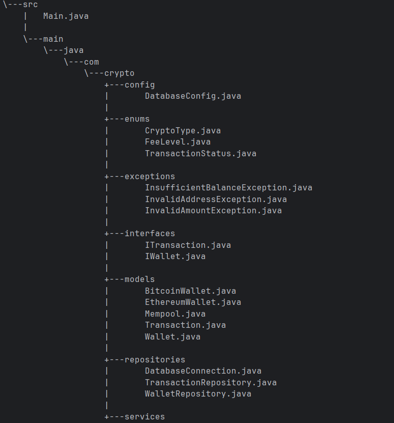

# 🚀 Crypto Wallet Simulator

## 📋 Description du Projet
**Crypto Wallet Simulator** est une application console Java qui simule un portefeuille cryptomonnaie avec système de mempool et calculateur de frais. L'application permet aux utilisateurs de comprendre comment les frais de transaction impactent la rapidité de confirmation dans une blockchain.

## 🎯 Fonctionnalités Principales

### 💼 Gestion des Wallets
- ✅ Création de wallets Bitcoin et Ethereum
- ✅ Génération automatique d'adresses cryptographiques
- ✅ Gestion des soldes et historique des transactions

### 🔄 Système de Transactions
- ✅ Création de transactions avec 3 niveaux de frais
- ✅ Validation des adresses de destination
- ✅ Calcul automatique des frais selon le type de crypto
- ✅ Simulation réaliste du mempool

### ⏰ Optimisation des Frais
- ✅ Comparaison des 3 niveaux de frais (Économique, Standard, Rapide)
- ✅ Estimation du temps de confirmation
- ✅ Calcul de position dans le mempool
- ✅ Visualisation du compromis coût/rapidité

### 🏗️ Architecture Technique
- ✅ Design Pattern Singleton pour les services
- ✅ Repository Pattern pour l'accès aux données
- ✅ Principes SOLID respectés
- ✅ Gestion complète des exceptions

## 🛠️ Technologies Utilisées

- **Java 8** - Langage de programmation
- **PostgreSQL** - Base de données
- **JDBC** - Connexion base de données
- **Java Time API** - Gestion des dates
- **java.util.logging** - Système de logging

## 📁 Structure du Projet



## ⚙️ Prérequis et Installation

### 1. Prérequis Système
- **Java JDK 8**
- **PostgreSQL 12+**
- **Windows/Linux/Mac**

### 2. Installation de la Base de Données

```sql
-- Créer la base de données
CREATE DATABASE crypto_wallet;

-- Les tables seront créées automatiquement au premier lancement

### 3. Configuration
Modifiez DatabaseConfig.java selon votre configuration PostgreSQL :


