# 🚀 Crypto Wallet Simulator

## 📋 Description du Projet
**Crypto Wallet Simulator** est une application console Java qui simule un portefeuille cryptomonnaie avec système de mempool et calculateur de frais. L'application permet aux utilisateurs de comprendre comment les frais de transaction impactent la rapidité de confirmation dans une blockchain.

## 🎯 Fonctionnalités Principales

### 💼 Gestion des Wallets
- ✅ Création de wallets Bitcoin et Ethereum
- ✅ Génération automatique d'adresses cryptographiques
- ✅ Gestion des soldes et historique des transactions

### 🔄 Système de Transactions
- ✅ Création de transactions avec 3 niveaux de frais
- ✅ Validation des adresses de destination
- ✅ Calcul automatique des frais selon le type de crypto
- ✅ Simulation réaliste du mempool

### ⏰ Optimisation des Frais
- ✅ Comparaison des 3 niveaux de frais (Économique, Standard, Rapide)
- ✅ Estimation du temps de confirmation
- ✅ Calcul de position dans le mempool
- ✅ Visualisation du compromis coût/rapidité

### 🏗️ Architecture Technique
- ✅ Design Pattern Singleton pour les services
- ✅ Repository Pattern pour l'accès aux données
- ✅ Principes SOLID respectés
- ✅ Gestion complète des exceptions

## 🛠️ Technologies Utilisées

- **Java 8** - Langage de programmation
- **PostgreSQL** - Base de données
- **JDBC** - Connexion base de données
- **Java Time API** - Gestion des dates
- **java.util.logging** - Système de logging

## 📁 Structure du Projet

```
\---src
    |   Main.java
    |   
    \---main
        \---java
            \---com
                \---crypto
                    +---config
                    |       DatabaseConfig.java
                    |       
                    +---enums
                    |       CryptoType.java
                    |       FeeLevel.java
                    |       TransactionStatus.java
                    |       
                    +---exceptions
                    |       InsufficientBalanceException.java
                    |       InvalidAddressException.java
                    |       InvalidAmountException.java
                    |       
                    +---interfaces
                    |       ITransaction.java
                    |       IWallet.java
                    |       
                    +---models
                    |       BitcoinWallet.java
                    |       EthereumWallet.java
                    |       Mempool.java
                    |       Transaction.java
                    |       Wallet.java
                    |       
                    +---repositories
                    |       DatabaseConnection.java
                    |       TransactionRepository.java
                    |       WalletRepository.java
                    |       
                    +---services
                    |       MempoolService.java
                    |       TransactionService.java
                    |       WalletService.java
                    |       
                    \---utils
                            AddressValidator.java
                            FeeCalculator.java
                            LoggerUtil.java
   ```                         

## ⚙️ Prérequis et Installation

### 1. Prérequis Système
- **Java JDK 8**
- **PostgreSQL 12+**
- **Windows/Linux/Mac**

### 2. Installation de la Base de Données

```sql
-- Créer la base de données
CREATE DATABASE crypto_wallet;

CREATE TABLE wallets (
    id UUID PRIMARY KEY,
    address VARCHAR(255) NOT NULL UNIQUE,
    balance DOUBLE PRECISION NOT NULL DEFAULT 0.0,
    crypto_type VARCHAR(20) NOT NULL,
    created_at TIMESTAMP DEFAULT CURRENT_TIMESTAMP
);

CREATE TABLE transactions (
    id UUID PRIMARY KEY,
    source_address VARCHAR(255) NOT NULL,
    destination_address VARCHAR(255) NOT NULL,
    amount DOUBLE PRECISION NOT NULL,
    fees DOUBLE PRECISION NOT NULL,
    creation_date TIMESTAMP NOT NULL,
    fee_level VARCHAR(20) NOT NULL,
    status VARCHAR(20) NOT NULL,
    crypto_type VARCHAR(20) NOT NULL,
    wallet_id UUID REFERENCES wallets(id) ON DELETE CASCADE,
    confirmed_at TIMESTAMP NULL
);

```

### 3. Configuration
Modifiez DatabaseConfig.java selon votre configuration PostgreSQL :

```
public class DatabaseConfig {
    public static final String URL = "jdbc:postgresql://localhost:5432/crypto_wallet";
    public static final String USERNAME = "postgres";
    public static final String PASSWORD = "votre_mot_de_passe";
}
```

### 🎮 Guide d'Utilisation
### Menu Principal
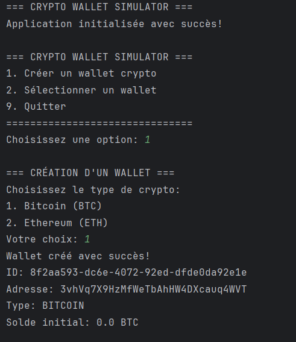
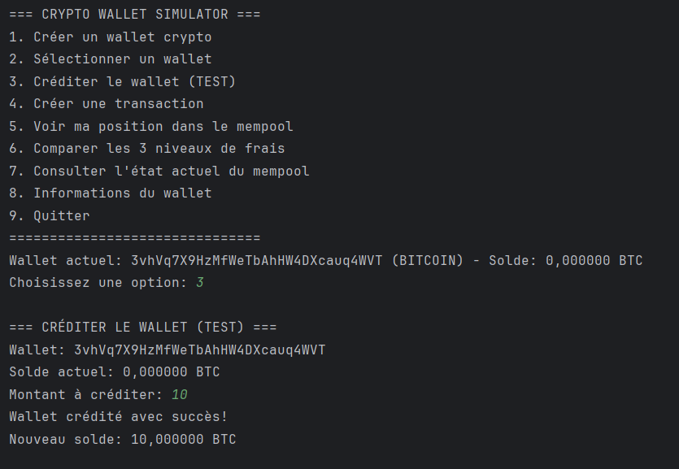
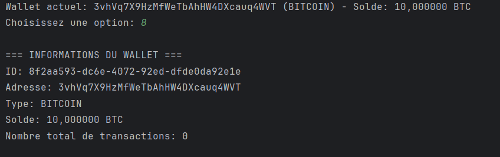
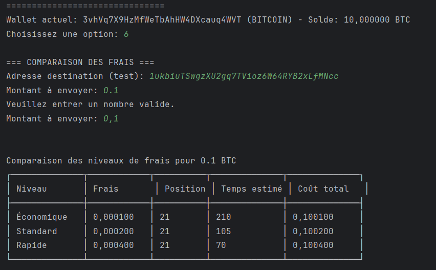
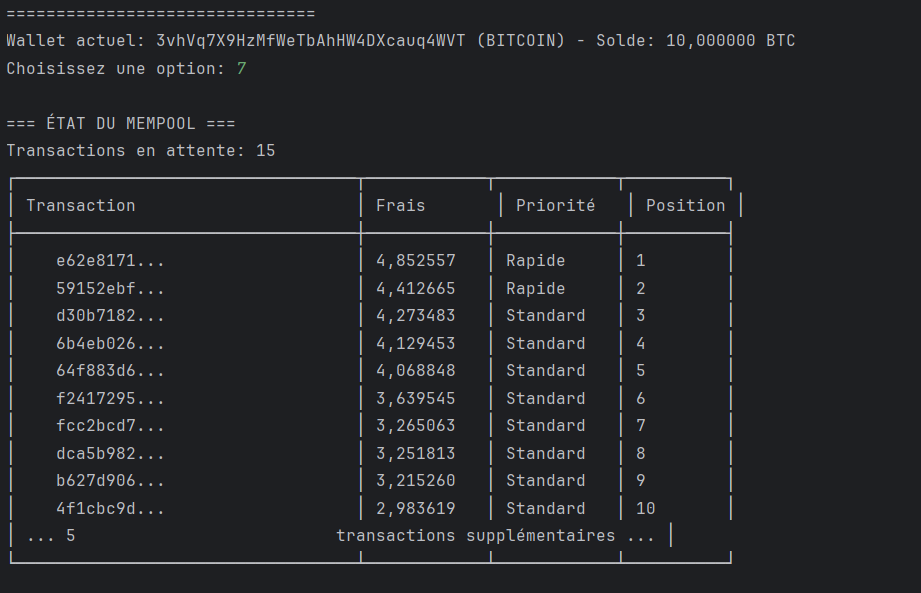
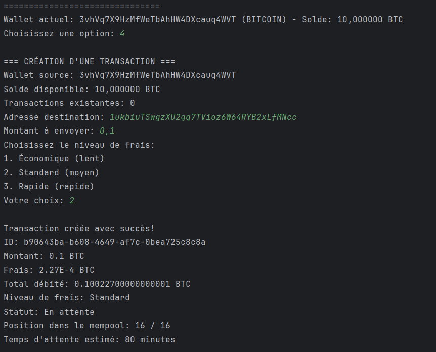
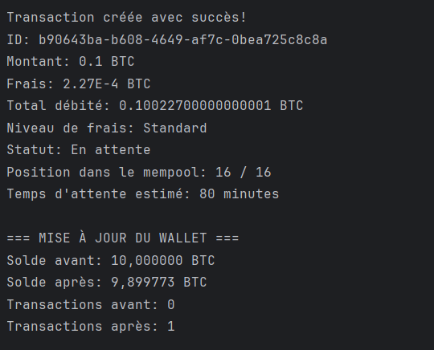
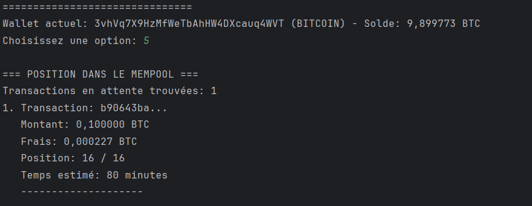
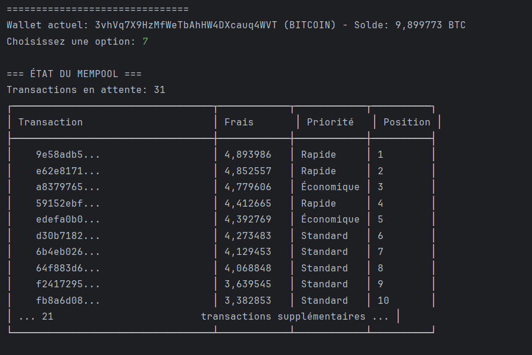
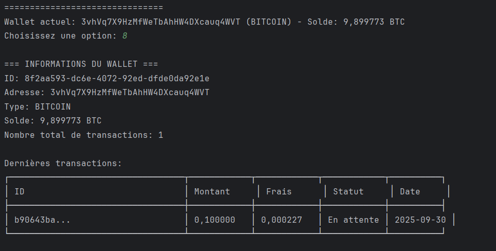
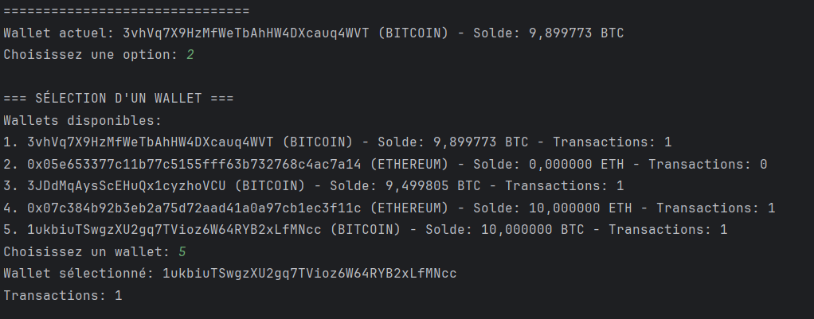


### 📝 Journalisation (Logging)
Les logs sont sauvegardés dans logs/crypto-wallet.log :

```
[2025-09-23 12:13:57] INFO: CryptoWalletSimulator - === Test de connexion à PostgreSQL ===
[2025-09-23 12:21:35] INFO: CryptoWalletSimulator - === Test de connexion à PostgreSQL ===
[2025-09-23 14:04:28] SEVERE: CryptoWalletSimulator - Erreur de connexion à la base de données: FATAL: authentification par mot de passe �chou�e pour l'utilisateur  � postgres �
[2025-09-23 14:21:39] INFO: CryptoWalletSimulator - === Test de connexion à PostgreSQL ===
[2025-09-23 14:21:40] INFO: CryptoWalletSimulator - Connexion à la base de données établie avec succès
```

### 🚀 Fonctionnalités Avancées
### Validation des Adresses
Bitcoin: Format 1, 3, ou bc1 avec 25-39 caractères

Ethereum: Format 0x avec 40 caractères hexadécimaux

### Gestion d'Erreurs
Solde insuffisant

Adresse invalide

Montant négatif

Connexion base de données

### Génération Aléatoire
Transactions simulées pour le mempool

Adresses cryptographiques réalistes

Variation des frais selon la congestion

### 👥 Auteur
Votre Nom
🐙 GitHub: @https://github.com/ichrakjaifra


